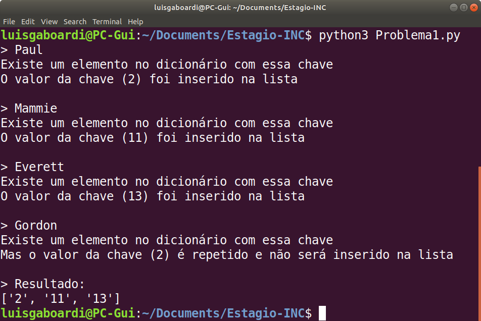
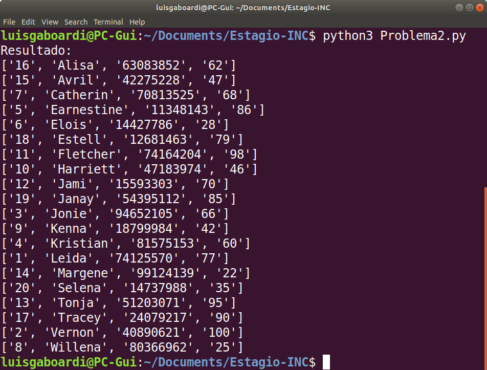

# Processo Seletivo para Estágio na Polícia Federal

    

## Candidato
Luís Guilherme Gaboardi Lins

## Link para o vídeo explicativo
https://youtu.be/l5iZHNbwZds

## Sobre 
A primeira fase do processo seletivo se dará pela resolução e apresentação de duas questões passadas pelos examinadores, a serem resolvidos na linguagem de programação Python, envolvendo estrutura e gestão de dados.

## Primeiro Problema
Dada uma lista de dicionários (chave/valor) Python, verifique se existe a chave 'nome', e caso exista, salve o valor dessa chave em uma segunda lista, de modo que não haja repetição de valores na segunda lista.

## Segundo Problema
Dado um arquivo csv com delimitador ';' e com o seguinte cabeçalho: id;nome;telefone;idade. 
Retorne uma lista com os registro ordenados por nome.

Exemplo de arquivo: 
Id;nome;telefone;idade  
1;João;43383832;28  
2;Maria;43839322;32  
.  
.  
.  
N;Zzzz;99999999;12  

## Entradas dos dois problemas
Para uma resolução palpável de ambos os problemas, gerei dois arquivos CSV que servem como entrada para cada questão. Eles podem ser encontrados dentro da pasta do respectivo problema.

## Utilização
**Linguagem**: Python 3.6.9 
**Desenvolvido em**: Ubuntu 18.04 LTS

Após o download do repositório, seja via git ou Zip, acesse a pasta:

` path/Processo-Seletivo-PF_01-21 `

### Questão 1

1. Em um ambiente capaz de executar arquivos python (extensão .py), acesse a pasta do primeiro problema.

      ` Processo-Seletivo-PF_01-21/Problema1 `

2. Execute o arquivo com:

      ` python3 Problema1.py `

3. A aplicação estará esperando entrada de usuário, a saber, uma ou mais _chaves_
 que se deseja saber se estão no dicionário ou não, e se deve adicionar os valores das chaves na lista de resposta.
 Como sugestão de teste, copie e cole na tela *um nome por vez (para melhor visualização)*:
 
        Paul
        Everett
        Pedro
        Gordon

4. Para cada chave que o usuário entrar, o terminal devolverá uma mensagem indicando o que ocorreu com a informação requisitada.

5. Encerre a execução do programa pressionando *CTRL+D*. No mesmo instante, a lista resultante será apresentada na tela. Além disso, a resposta também pode ser visualizada no arquivo _Resposta1.csv_ que será criado no mesmo diretório.

### Questão 2

1. Em um ambiente capaz de executar arquivos python (extensão .py), acesse a pasta do segundo problema.

      ` Processo-Seletivo-PF_01-21/Problema2 `

2. Execute o arquivo com:

      ` python3 Problema2.py `
      
3. Imediatamente, no terminal você verá a lista de entrada ordenada por nome alfabeticamente. Da mesma forma que no problema 1, também será gerado um arquivo CSV no mesmo diretório chamado *Reposta2.csv*, no qual acredito que a visualização da solução seja mais fácil.

## Observações 
Ambos os problemas podem também ser resolvidos de maneira eficaz utilizando uma tabela Hash, por esse motivo, desenvolvi tanto a solução utilizando Hash como a solução sem. Entretanto, visto que os casos de teste que utilizei são pequenos, dou preferência à solução sem Hash. Caso houvesse a necessidade de escalonamento do problema, utilizaria a solução com Hash.

## Screenshots

### Problema 1
    

### Problema 2
    
